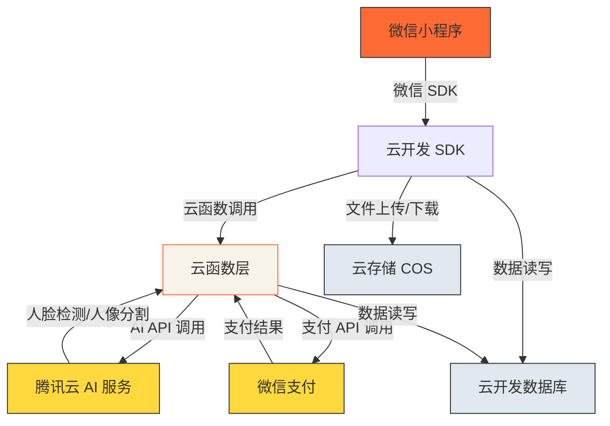

# 技术方案设计

## 架构概述

本证件照小程序采用云原生架构,前端使用微信小程序原生开发,后端使用腾讯云云函数,数据存储使用云开发数据库和云存储。通过小程序天然免登录特性(OPENID)实现用户身份管理。

## 技术栈

### 前端
- **框架**: 微信小程序原生开发
- **基础库版本**: latest (使用最新版本)
- **UI 设计**: Editorial/Magazine 风格
  - 配色: 暖橙红(#FF6B35) + 米白(#F7F3E8) + 深灰黑(#2D3436)
  - 字体: Georgia (标题) + Helvetica Neue (正文)
  - 布局: 非对称编辑式布局
- **云开发 SDK**: @cloudbase/wx-cloud-client-sdk (版本 2.x)

### 后端
- **云函数**: Node.js 16.13 (支持 ES6+)
- **AI 能力**: 腾讯云 AI 服务
  - 人脸检测: 腾讯云人脸检测 API
  - 人像分割: 腾讯云人像分割 API
  - 图像处理: Canvas API + Sharp 库
- **支付**: 微信支付 JSAPI (云函数实现)

### 数据存储
- **数据库**: 云开发文档型数据库 (NoSQL)
  - 集合: users, images, orders, history, specs
- **云存储**: 腾讯云 COS (云开发存储)
  - 图片上传/下载
  - 临时访问 URL 生成

### 部署
- **云函数部署**: 云开发云函数服务
- **小程序发布**: 微信开发者工具

## 系统架构



## 数据库设计

### 集合结构

#### 1. users (用户表)
```json
{
  "_id": "用户ID (自动生成)",
  "openid": "微信OPENID (唯一标识)",
  "nickname": "用户昵称",
  "avatar": "用户头像URL",
  "create_time": "创建时间",
  "_openid": "用户OPENID (用于权限控制)"
}
```

#### 2. specs (规格表)
```json
{
  "_id": "规格ID (自动生成)",
  "name": "规格名称 (一寸/二寸/护照/签证)",
  "width_mm": "宽度 (毫米)",
  "height_mm": "高度 (毫米)",
  "dpi": "分辨率 (300)",
  "pixel_width": "像素宽度",
  "pixel_height": "像素高度",
  "_openid": "admin (管理员标识)"
}
```

#### 3. images (图片表)
```json
{
  "_id": "图片ID (自动生成)",
  "user_id": "用户ID (关联users表)",
  "type": "图片类型 (original/cropped/final)",
  "url": "图片URL (云存储)",
  "file_id": "云存储文件ID",
  "create_time": "创建时间",
  "_openid": "用户OPENID (用于权限控制)"
}
```

#### 4. history (历史记录表)
```json
{
  "_id": "记录ID (自动生成)",
  "user_id": "用户ID (关联users表)",
  "spec_id": "规格ID (关联specs表)",
  "spec_name": "规格名称",
  "original_image_id": "原图ID (关联images表)",
  "cropped_image_id": "裁剪图ID (关联images表)",
  "final_image_id": "最终图ID (关联images表)",
  "create_time": "创建时间",
  "_openid": "用户OPENID (用于权限控制)"
}
```

#### 5. orders (订单表)
```json
{
  "_id": "订单ID (自动生成)",
  "user_id": "用户ID (关联users表)",
  "image_id": "图片ID (关联images表)",
  "history_id": "历史记录ID (关联history表)",
  "amount": "金额 (元)",
  "status": "状态 (pending/paid/failed)",
  "prepay_id": "微信预支付ID",
  "create_time": "创建时间",
  "pay_time": "支付时间",
  "_openid": "用户OPENID (用于权限控制)"
}
```

## 接口设计

### 云函数列表

#### 1. auth (认证云函数)
```javascript
// 功能: 获取用户 OPENID
// 入参: 无
// 返回: { openid: string }
```

#### 2. upload (上传云函数)
```javascript
// 功能: 上传图片到云存储
// 入参: { fileData: base64 }
// 返回: { fileId: string, url: string }
```

#### 3. faceDetect (人脸检测云函数)
```javascript
// 功能: 调用腾讯云人脸检测 API
// 入参: { imageUrl: string }
// 返回: { faceRect: { x, y, width, height } }
```

#### 4. portraitSegment (人像分割云函数)
```javascript
// 功能: 调用腾讯云人像分割 API
// 入参: { imageUrl: string }
// 返回: { maskUrl: string }
```

#### 5. cropImage (裁剪图片云函数)
```javascript
// 功能: 根据人脸位置和规格裁剪图片
// 入参: { imageUrl: string, faceRect, specId }
// 返回: { croppedUrl: string }
```

#### 6. replaceBackground (背景替换云函数)
```javascript
// 功能: 替换图片背景
// 入参: { imageUrl: string, maskUrl: string, bgColor: string }
// 返回: { finalUrl: string }
```

#### 7. createOrder (创建订单云函数)
```javascript
// 功能: 创建订单并调起微信支付
// 入参: { imageId: string, historyId: string }
// 返回: { prepayId: string, orderNo: string }
```

#### 8. saveHistory (保存历史记录云函数)
```javascript
// 功能: 保存历史记录
// 入参: { specId, originalImageId, croppedImageId, finalImageId }
// 返回: { historyId: string }
```

#### 9. getHistory (获取历史记录云函数)
```javascript
// 功能: 获取用户历史记录列表
// 入参: { limit, offset }
// 返回: { list: array }
```

#### 10. deleteHistory (删除历史记录云函数)
```javascript
// 功能: 删除历史记录
// 入参: { historyId: string }
// 返回: { success: boolean }
```

## 页面设计与交互流程

### 核心流程
```
首页 → 上传照片 → 规格选择 → 裁剪调整 → 背景替换 → 导出 → 支付/下载
                              ↑                                      ↓
                              └──────────── 历史记录 ←──────┘
```

### 页面结构
- **TabBar**: 首页、历史记录、我的
- **页面栈**: 最多 10 层
- **路由**: 页面间通过 wx.navigateTo / wx.redirectTo 跳转

## 安全性设计

### 数据库权限
- **users**: CUSTOM 规则,用户只能读写自己的数据
- **specs**: READONLY 规则,管理员可写,用户只读
- **images**: CUSTOM 规则,用户只能读写自己的图片
- **history**: CUSTOM 规则,用户只能读写自己的历史
- **orders**: CUSTOM 规则,用户只能读写自己的订单

### 云函数权限
- 云函数拥有管理员权限,可读写所有数据
- 前端通过云函数间接访问数据库
- 禁止前端直接修改数据库

### 支付安全
- 使用微信官方支付 SDK
- 订单状态验证: 后端验证支付回调
- 防止重复支付: 订单号唯一性校验

## 测试策略

### 单元测试
- 云函数逻辑测试
- 数据库操作测试
- AI API 调用测试

### 集成测试
- 完整流程测试: 上传 → 裁剪 → 背景 → 导出
- 支付流程测试: 创建订单 → 支付 → 下载
- 历史记录测试: 保存 → 查看 → 删除

### 兼容性测试
- iOS 微信版本测试
- Android 微信版本测试
- 不同机型适配测试

## 性能优化

### 图片优化
- 上传图片压缩: 限制最大 5MB
- 云存储 CDN 加速
- 图片懒加载

### 云函数优化
- 使用云函数缓存
- AI API 调用并发控制
- 数据库索引优化

### 前端优化
- 图片懒加载
- 页面预加载
- 骨架屏加载

## 部署策略

### 开发环境
- 云函数: 开发版本
- 数据库: 开发环境
- 云存储: 开发环境

### 生产环境
- 云函数: 发布版本
- 数据库: 生产环境
- 云存储: 生产环境
- 微信支付: 正式环境

### 环境ID
- 开发环境: cloud1-3gffxfbw1b36f8a6
- 小程序 AppID: 需在 project.config.json 中配置

## 监控与日志

### 云函数监控
- 调用次数统计
- 错误日志收集
- 性能指标监控

### 业务监控
- 用户活跃度
- 订单转化率
- AI API 调用成功率

### 日志管理
- 云函数日志: 云开发日志服务
- 用户行为日志: 自定义日志收集
- 错误追踪: 错误上报机制

## 后续扩展

### 功能扩展
- 趣味模板系统
- 社交分享功能
- 提醒通知功能
- 更多证件照规格

### 性能扩展
- AI 模型优化(本地部署)
- 图片处理服务独立部署
- 支付渠道扩展(支付宝)

### 运营扩展
- 数据分析系统
- 用户反馈系统
- 营销活动系统
